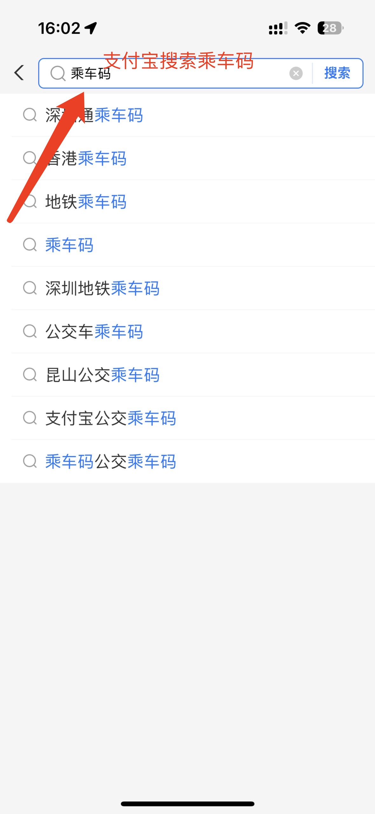
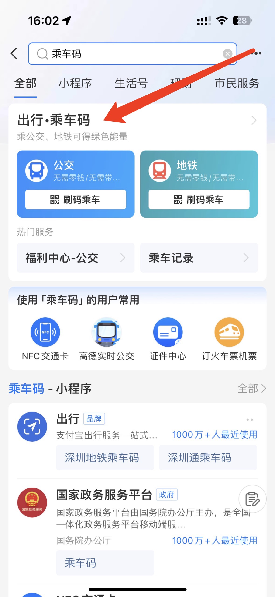
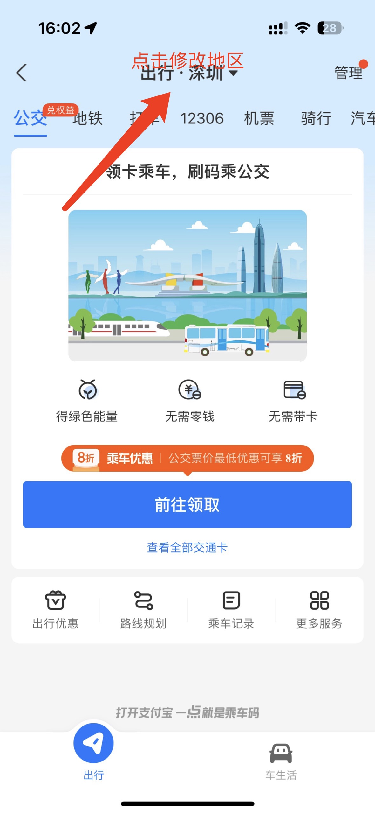
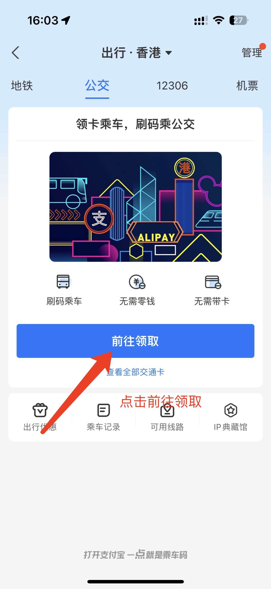
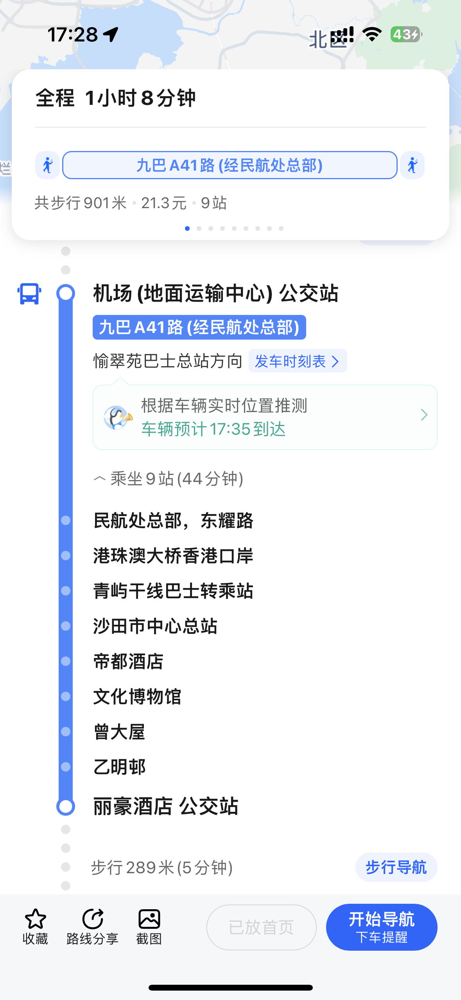
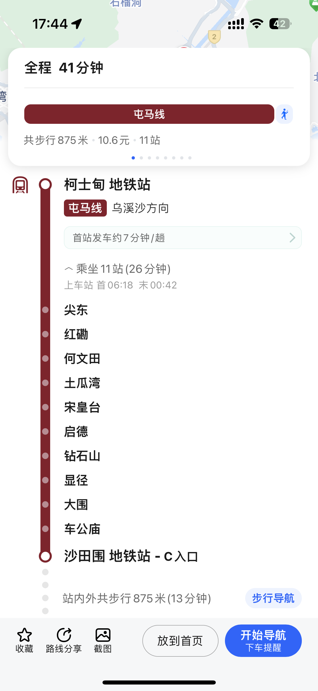
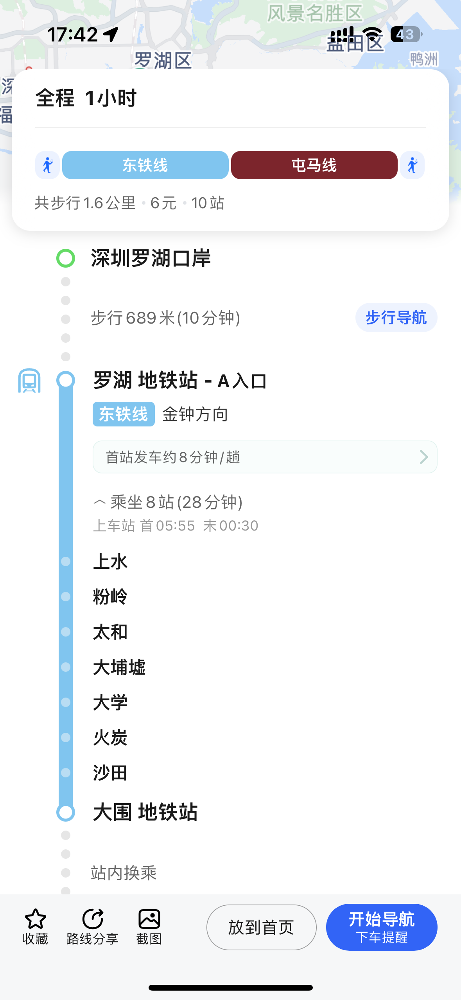
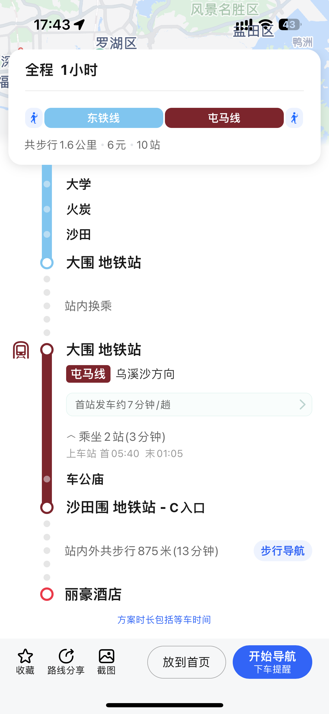

# 交通指引（前往丽豪酒店）
organiznig commitee@2023 International Doctoral Forum
0. # 支付方式

香港地铁以及香港巴士（大巴）均以支持支付宝二维码乘车，请提前修改乘车码地区为**香港**，具体操作如下：

出现香港公交二维码即为领取成功。除了支付宝二维码乘车外，香港巴士也支持用银联卡拍卡支付。

1. # 香港国际机场→ 丽豪酒店

经由香港国际机场抵港的同学们请跟随机场的指引前往机场公交站乘搭A41路公交车。请搭乘往愉翠苑巴士总站方向的车，乘坐9站到达丽豪酒店公交站。***请注意***香港巴士在下车前需要**提前按下车上的铃** （一般在车内扶手上的红色按钮）来提示司机下一站有人下车，否则司机有可能会不停站直接开过。同学们需要在丽豪酒店公交站下车，麻烦留意车上屏幕和广播，请在巴士从乙明邨站开出后按下响铃按钮告知司机下一站有人下车。

2. # 西九龙高铁站 → 丽豪酒店

经由西九龙高铁站抵港的同学可以根据高铁站引导前往柯士甸港铁站搭乘往乌溪沙方向的屯马线。乘坐11站在沙田围地铁站下车，步行13分钟左右抵达丽豪酒店。步行导航可以参考各类地图软件（推荐谷歌地图以及高德地图）。

3. # 罗湖口岸/福田口岸 → 丽豪酒店

经由深圳罗湖口岸或者福田口岸抵港的同学请请搭乘东铁线往金钟方向。乘坐8站在大围站下车并换成屯马线往乌溪沙方向。乘坐2站在沙田围地铁站下车，步行13分钟左右抵达丽豪酒店。步行导航可以参考各类地图软件（推荐谷歌地图以及高德地图）。

